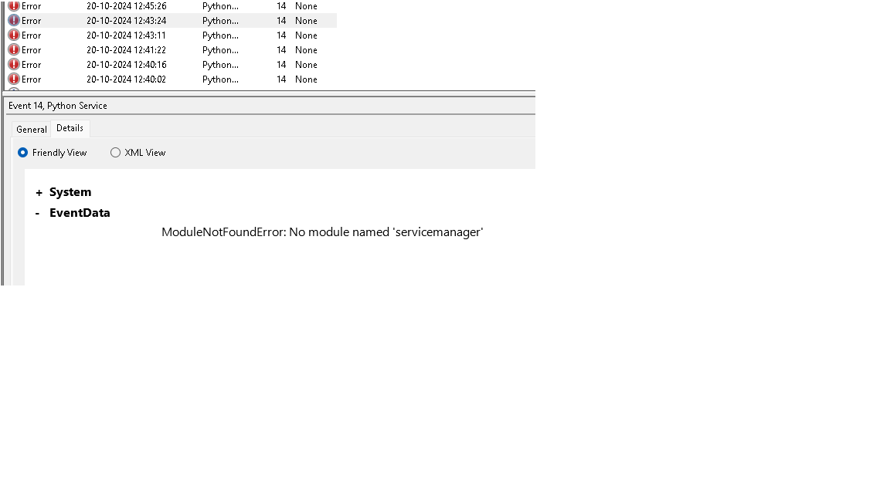

# Battery Monitor Service

A Python-based Windows service that monitors the battery status of your laptop. The service automatically puts the system to sleep when the laptop is running on battery power (i.e., not connected to a charger). The service runs in the background as a Windows service.

## Features

- Monitors the battery status in real-time.
- Automatically puts the system to sleep when the laptop is not charging.
- Runs as a Windows service that starts automatically when the system boots.
- Minimal resource usage and configurable for any number of checks.

## Requirements

- Windows operating system
- Python 3.x (tested with Python 3.10)
- `pywin32` package to create and manage the Windows service
- `wmi` package to access system information

## Installation and Setup

### Step 1: Clone the Repository

```bash
git clone https://github.com/yourusername/battery-monitor-service.git
cd battery-monitor-service
```

### Step 2: Install Required Packages

```bash
pip install -r requirements.txt
python -m pywin32_postinstall
```

### Step 3: Configure and Install the Service

- Open bash terminal with administrator privileges

```bash
python battery_monitor_service.py install
```

- This registers the Python script as a Windows service.

### Step 4: Start the Service

- To start the service

```bash
python battery_monitor_service.py start
```


- Check the status

```bash
sc query BatteryMonitorService
```

- Alternatively, you can verify status/start the service in ```serives.msc```


- To stop the service

```bash
python battery_monitor_service.py stop
```

### Troubleshooting

1. If you encounter the error ```MoveFileEx: Access is denied``` during installation or service updates, ensure that you:

- Run the commands as an administrator.
- Stop the service before making updates.
- Manually copy the ```pythonservice.exe``` file from the lib\site-packages\win32 folder to your Python installation folder.
- Worst case, restart your system and the problem should be resolved

### checking Logs

To monitor the service logs, open the Windows Event Viewer:

- Press ```Windows + R``` and type ```eventvwr.msc``` to open the Event Viewer.
- Navigate to Windows Logs > Application and look for logs with the source set to ```Python Service```.



### Updating the service

- If you make changes to the script, follow these steps to update the service:

```bash
python battery_monitor_service.py stop
```

- Modify your source code as needed.

- Start the service again

```bash
python battery_monitor_service.py start
```

### Uninstalling the service

- To uninstall the service:

```bash
python battery_monitor_service.py remove
```

- This will remove the service from Windows.

### Contributing

- Feel free to fork this repository, submit issues, and make pull requests. Any contributions are welcome!